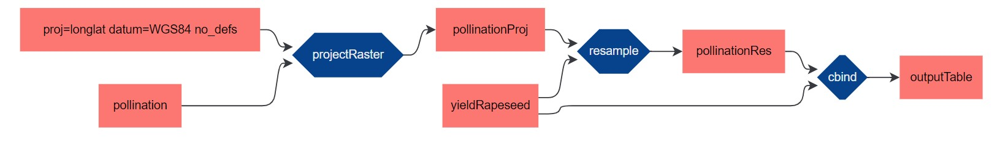

# R2PROV-O

__Convert R method calls to PROV-O.__

_This package is in development. To use it, the `devtools` package is required. To use the packages methods, you need to start an R environment in this readmes directory, load the `devtools` package and run the command `load_all()`. The console output after this command should be `i Loading r2provo`._

## TL;DR

```r
# library("r2provo")
# ------------------

init_prov()

eval(prov(quote(...)))
eval(prov(quote(...)))
eval(prov(quote(...)))
...
eval(prov(quote(...)))

store_prov("filename.ttl")

```
Visualize at https://geokur-dmp2.geo.tu-dresden.de/provViewer/.

## Introduction

The PROV Data Model (PROV-DM) is a W3C recommendation for gathering provenance data. The PROV-Ontology (PROV-O) expresses the PROV-DM as RDF. PROV-O conform provenance graphs can be visualized at https://geokur-dmp2.geo.tu-dresden.de/provViewer/.

Many R data processing scrips that convert some input data in some output data, do so, by using
successive method calls from the wide range of available data processing packages
in R (or some self implemented methods).

Conditioned by the syntax, each method call follows a common set of patterns. `r2provo` converts this patterns to PROV-O and attaches them to a common provenance graph.

As this implementation is prototypical, it only works for the arguably most common pattern: One output is generated by some method, which in turn uses one or more inputs.

```r
ex_output <- ex_method(ex_input_1, ex_input_2, ..., ex_input_n)
```

To convert this example to a provenance graph, the user needs to wrap it in a triple of commands:

```
eval(prov(quote(
   ex_output <- ex_method(ex_input_1, ex_input_2, ..., ex_input_n) 
)))
```

The two methods `eval()` and `quote()` are native to R, whilst `prov()` is a method from `r2provo`. 
    
- `quote()`: Converts R code in inside the parenthesis into an R language object, without executing it.
- `prov()`: Converts an R language object to PROV-O and adds it to the provenance graph. Returns the R language object.
- `eval()`: Executes an R language object or a string.

To connect to methods in the resulting provenance graph, the output of one method needs to be in the input of another method:

```
eval(prov(quote(
   ex_output <- ex_method(ex_input_1, ex_input_2, ..., ex_input_n)
)))

eval(prov(quote(
   ex_output_final <- ex_method_final(ex_output)
)))
```

## Example

To showcase the package we use an example where data from two raster datasets gets combined in a common table. Before this is is possible, one of the datasets needs to be reprojected and resampled to the other datasets coordinate reference system and sample size. These steps require the two R packages `raster` and `rgdal`.

```r
#---- Load required packages
if (!require("raster")) install.packages("raster")
library("raster")
if (!require("rgdal")) install.packages("rgdal")
library("rgdal")
```

In the next step, we initialize the provenance graph by calling `init_prov()` and download the input datasets.

```r

#----
init_prov()

# get data
poll_url <- "https://geokur-dmp.geo.tu-dresden.de/dataset/1383628b-633b-401d-9277-977b90fc83a0/resource/eeecaa00-4da4-4022-9ae6-8a7849e9d5c1/download/3b_visitprob.tif"
pollination <- raster(poll_url)

rapeseed_url <- "https://geokur-dmp.geo.tu-dresden.de/dataset/6f99ba93-ad5a-4841-9b56-fa4edda9f3b9/resource/945acf8d-925f-44c5-8f45-4b6354f1734d/download/rapeseed_yieldperhectare.tif"
yieldRapeseed <- raster(rapeseed_url)
```

In the next step we reproject the pollination raster and add this processing step to the provenance graph.

```r
# project raster
eval(prov(quote(
    pollinationProj <- projectRaster(pollination, crs = "+proj=longlat +datum=WGS84 +no_defs")
)))
```

We then resample the reprojected raster. Note that the output of the last method is part of the input of the following method.

```r
# resample to 5 arcmin
eval(prov(quote(
    pollinationRes <- resample(pollinationProj, yieldRapeseed)
)))
```

The following processing step combines the two rasters with the method `cbind`. Because `cbind` requires dataframes as input, we have to convert the rasters beforehand. We don't want this simple conversions to be part of the resulting provenance graph. Therefore, to guarantee a connected provenance graph, we overwrite the existing variables `yieldRapeseed` and `pollinationRes` with their dataframe versions and then use the dataframes as inputs. Concatenation in the provenance graph is achieved, because the variables names are consistent.

```r
# convert to df and overwrite existing variables
yieldRapeseed <- as.data.frame(yieldRapeseed)
pollinationRes <- as.data.frame(pollinationRes)

# combine pollination and yield data  to table
eval(prov(quote(
    outputTable <- cbind(yieldRapeseed, pollinationRes)
)))
```

A last step could comprise the removing of zero and n.a. values from the output table. In R, this could be done with the following command:

```r
finalTable <- outputTable[which(outputTable$yieldRapeseed > 0 & !is.na(outputTable$pollination)), ]
```

As this command is not a method call, we cannot simply wrap it in `eval(prov(quote()))`. If we want to store this last bit of provenance with the prototypical implementation of `r2provo`, we need to write a more or less senseless function:

```r
cleanTable <- function(inTable) {
    return(outputTable[which(inTable$yieldRapeseed > 0 & !is.na(inTable$pollination)), ])
}

eval(prov(quote(
    finalTable <- cleanTable(outputTable)
)))
```

Finally, we have to call the `r2provo` method `store_prov("filename.ttl")` to serialize the provenance graph and of course, save the generated table.

```r
store_prov("use_case_short_prov.ttl")

write.csv(finalTable, "finalTable.csv")
```



## TO DO

- __identify and add more patterns__
- evaluate the R language objects objects and attach according metadata to  provenance graph
- simplify triple structure (maybe `prov()` could indicate that the next method call should be added to the graph)
- add possibility to enter custom namespace on `prov_init()`